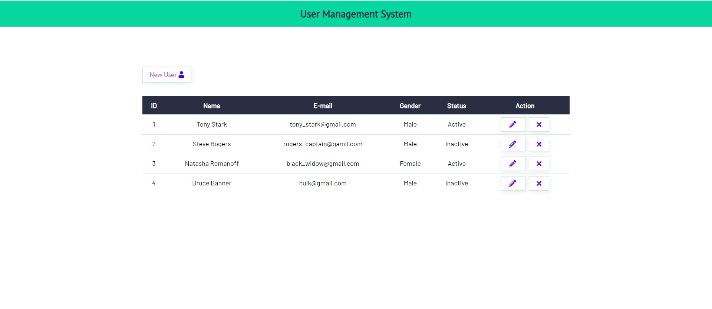

# CRUD-Application

Using Node.js, Express & MongoDB. 
A basic User Management application capable of performing CRUD operations; i.e., create-read-update-delete; for managing the details of users.

## Installation

run bash``npm i && npm start`` to start the app
    
